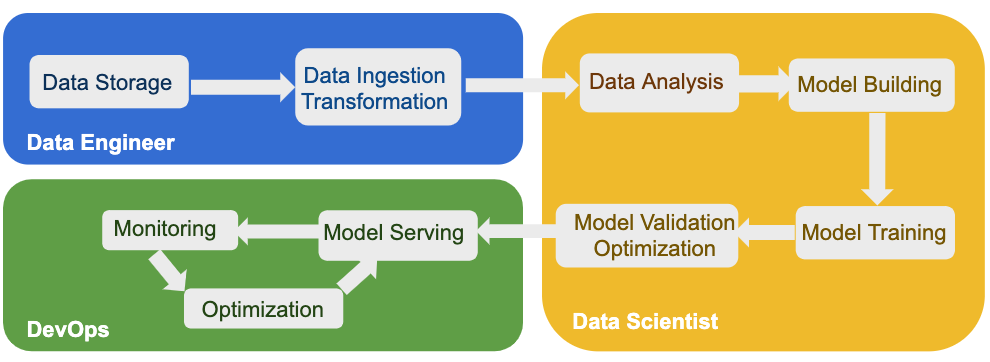

A complete end-to-end AI platform requires services for each step of the AI workflow. In general, an AI workflow includes most of the steps shown in Figure 1  and is used by multiple AI engineering personas such as Data Engineers, Data Scientists and DevOps.

**Figure 1: AI Workflow**

The first phase of an AI workflow is initiated by Data Engineers that acquire the data from different sources and perform the required transformations. Data Engineers are also responsible to store and provide access to the transformed data to Data Scientist or Data Analysts that work on the second phase in the AI workflow. In the second phase, Data Scientists perform analysis on the transformed data and create the appropriate ML models. Once the models are trained and validated accordingly, they are ready to be served on the production platform in the last phase of the AI end-to-end workflow. In the production phase, ML models are served as services on the cluster and DevOps engineers are tasked with constantly monitoring and optimizing the services. The process does not end at this last step, Data Scientists should monitor and keep validating models based on incoming and trained data sets.

**Red Hat® OpenShift®  Container Platform** is the leading Kubernetes based container application platform from Red Hat platform providing multiple functionalities for successfully running distributed AI workloads. Functionalities such as horizontal scaling, security, efficient resource management and operator framework are essential to successfully providing AI/ML services. GPU processing support for Openshift is also being worked on in collaboration with Nvidia.

**Open Data Hub** currently provides services on Openshift for AI data services such as data storage and ingestion/transformation. For data storage and availability, ODH provides [Ceph](https://ceph.com/), with multi protocol support including block, file and S3 object API support, both for persistent storage within the containers and as a scalable object storage data lake that AI applications can store and access data from . Rook operator can be used to easily deploy and integrate Ceph into the OpenShift and ODH ecosystem

Open Data Hub also provides services for model creation, training and validation. Apache Spark™([https://spark.apache.org/](https://spark.apache.org/)) operator is provided as part of ODH installation for distributed data ingestion, transformation and model functionalities running natively on Openshift. For the Data Scientist development environment, ODH provides Jupyter Hub and Jupyter Notebook images running natively distributed on Openshift. ODH roadmap includes tools for monitoring services as discussed in the section below. These tools will include the ability for natively monitoring AI services and served models on Openshift using Prometheus and Grafana.

**AI Library** provides REST interface access to pre-trained andw validated served models for Sentiment Analysis, Flake Analysis and Duplicate Bug Detection.

